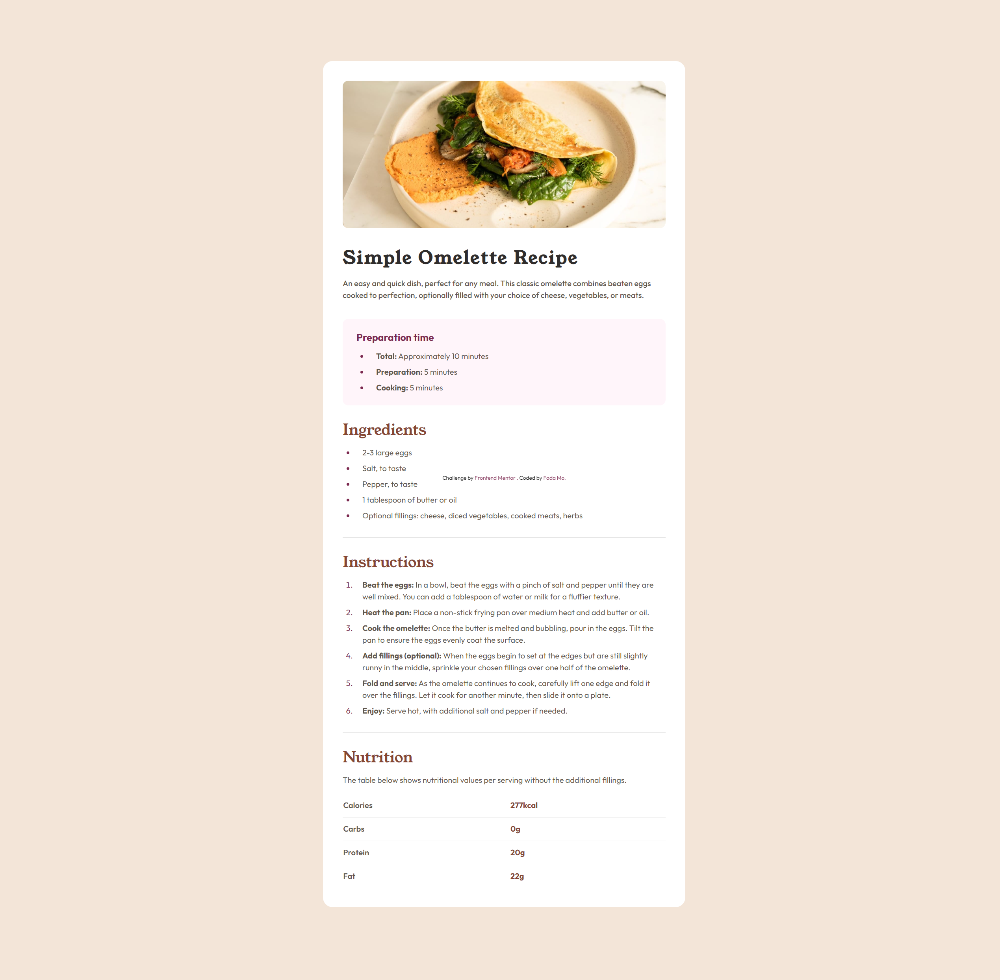
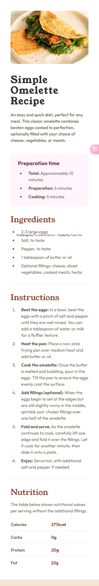

# Frontend Mentor - Recipe page

## Overview

### Screenshot

### Question 
#### 1. question one
There is a small flaw. I used the native table to implement the Nutrition at the bottom. The field on the left has no padding.
1. I tried to add padding-left, but it caused the field on the right to move.
2. Add padding-left to the field on the left, and then set the width, but fixed width will have problems on mobile.
   So is there any other better way?

### 2. question two
I still have some doubts about responsive design. In tailwindcss, I can use the md: tag to operate responsiveness. I don’t quite understand whether this means that the mobile terminal should be used first?

For example, the cover: h-[200px] md:h-[300px] at the top, the mobile terminal or the default is 200px, and the PC terminal or when the width exceeds 768px uses 300px

### Links

- Solution URL: [recipe-page-with-tailwind-css](https://www.frontendmentor.io/solutions/recipe-page-with-tailwind-css-Ii50a98PKE)
- Live Site URL: [recipe-page](https://mofada.github.io/recipe-page/)

## Author

- Frontend Mentor - [@mofada](https://www.frontendmentor.io/profile/mofada)
- Twitter - [@im_mofada](https://x.com/im_mofada)
